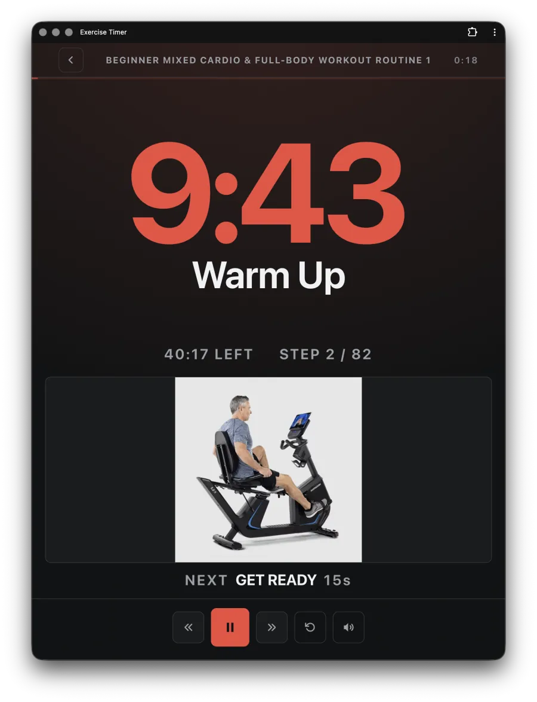
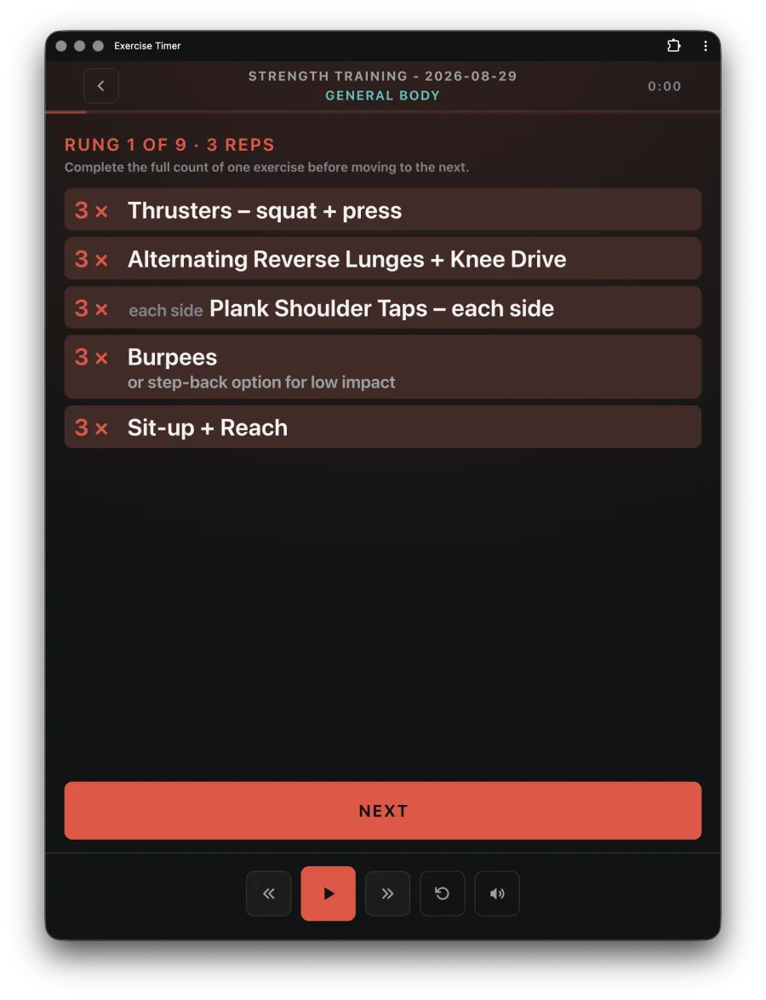
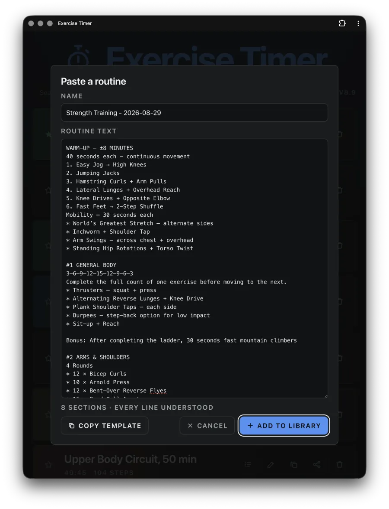
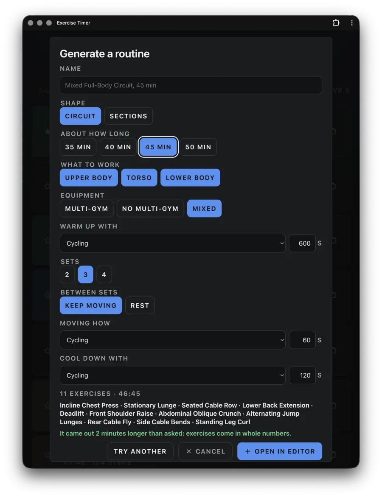
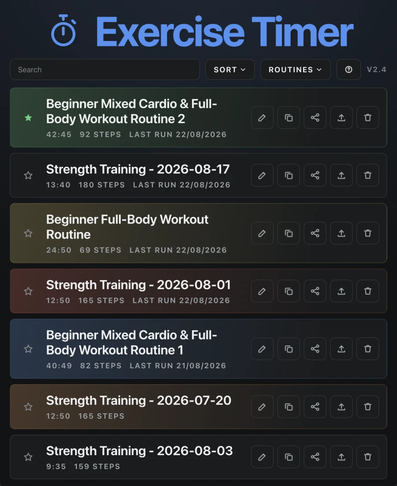
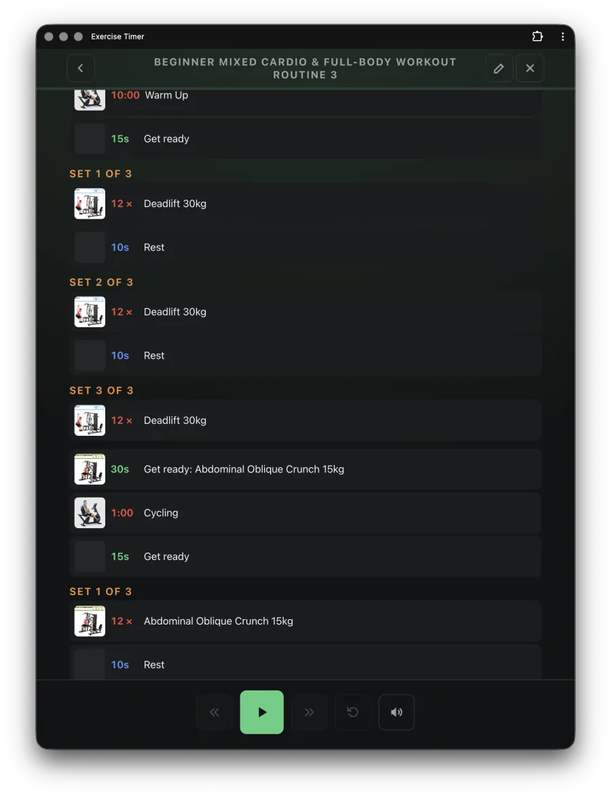
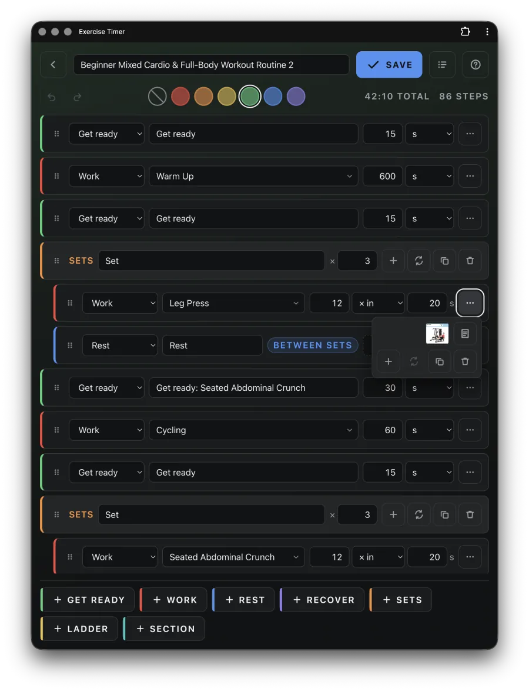
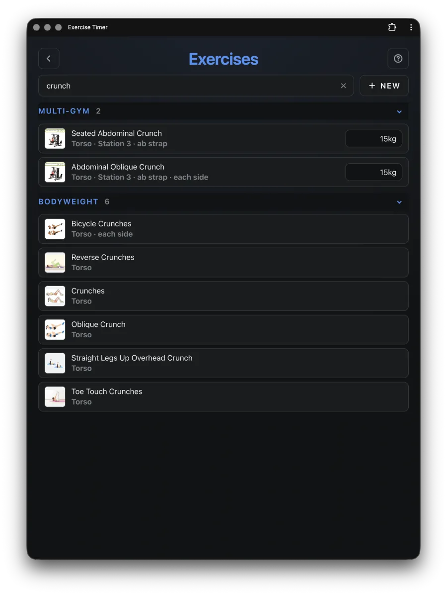

# Exercise Timer

An interval timer for gym routines. It runs in the browser, installs to a phone
home screen, and works offline.

**Live: https://waynetd777.github.io/exercise-timer/**

Nothing to clone, install or build. Open the link, add it to your home screen
from the browser's share menu, and it keeps working with no signal. The
instructions further down are for changing the code, not for using the app.

It was built for one job: telling you mid-effort how much longer to keep going,
from across a gym, with the phone propped against a rack.

## What it does best

- **A countdown you can read from across the room.** Big number, colour-coded
  phase, the exercise illustration beside it, and audio cues that stay on the
  beat even after the phone has been in your pocket.
- **Rep-based work, not just timed.** A strength session is mostly not on a
  clock. The whole round or ladder rung is on screen at once, and one Next
  clears it. Timed steps mixed in still count themselves down.
- **Paste a routine in as text.** An email from a gym instructor becomes
  sections, rounds, ladders, EMOM minutes, 30/30 intervals and AMRAPs. Anything
  it could not read is listed before anything is saved.
- **Or have one generated.** Answer a few questions, and it builds a routine in
  the shape of the ones it has been given.
- **One place for what you lift.** A weight and a picture per exercise. Any
  routine that does not say otherwise follows them, so moving up a plate is one
  edit rather than seven.
- **Yours, on your device.** No accounts, no server, no telemetry.

## What it looks like

<table>
  <tr>
    <td width="50%">
      
      <br /><b>A timed step.</b> The number is sized to be read from across a
      room, and the picture says which machine without a word.
    </td>
    <td width="50%">
      
      <br /><b>A rep-based rung.</b> The whole thing is on screen, and one Next
      clears it. You do not tap through a round with your hands full.
    </td>
  </tr>
  <tr>
    <td width="50%">
      
      <br /><b>Pasting one in.</b> A routine as it arrives, in text. The footer
      counts what it found and owns up to any line it could not read.
    </td>
    <td width="50%">
      
      <br /><b>Generating one.</b> Every answer updates the summary at the
      bottom, so you see the routine before you commit to it.
    </td>
  </tr>
  <tr>
    <td width="50%">
      
      <br /><b>The library.</b> Favourites pin to the top, and each routine's own
      colour makes it findable at a glance.
    </td>
    <td width="50%">
      
      <br /><b>Preview.</b> The whole routine written out in the order it will
      run, weights included, with Start still under your thumb.
    </td>
  </tr>
  <tr>
    <td width="50%">
      
      <br /><b>The editor.</b> Steps, sets, ladders and sections, with undo. The
      coloured edge on a row is its step type, and the add buttons match.
    </td>
    <td width="50%">
      
      <br /><b>The exercises page.</b> One picture and one weight per exercise,
      grouped by kit. Change a weight here and every routine follows.
    </td>
  </tr>
</table>

## The rest of it

**Imports** `.tabata` files from the Tabata Timer app, its own backups, and plain
text. See [the paste format](docs/paste-format.md) for everything the parser
reads, with an example using every part of it.

**Tidies names,** putting each step's exercise back under the name the app knows
it by, so weights and pictures find it. Counts, weights and brackets are left
exactly as they are.

**Says how long a routine takes,** including the self-paced parts a clock cannot
know, and learns your pace from the runs you actually do.

**Sends** a routine as a link, as plain text, or as a `.txt` it can read back.
None of them carries a picture, so each says what it left behind rather than
dropping it quietly.

**Backs up** one routine or the whole library to a `.json`, images and weights
included. It is the only format that carries everything, so it is the one to
keep.

**Owns its images.** Local copies, so a routine survives gym wifi and the image
host eventually losing a file.

## Running it locally

Only needed if you want to change the code.

```bash
npm install
npm run dev        # http://localhost:35173
npm test           # no browser needed
npm run lint       # oxlint: correctness and the rules of hooks
npm run typecheck
npm run build
```

`npm run dev` also unlocks the sound bench, at Routines then Sounds. It plays
every cue as the full figure and as its terminal sound alone, with the
parameters printed beside it. It is compiled out of a production build.

Deployment is automatic. A push to `main` builds and publishes to GitHub Pages,
gated on typecheck and tests, because a broken timer is worse than a stale one.
Pages serves from a subpath, so `VITE_BASE` is set in the workflow and every
bundled asset path goes through `import.meta.env.BASE_URL`.

## How it is put together

One principle runs through the codebase: **the hard logic is pure, and React is
a thin shell over it.** Anything with rules worth arguing about is a plain
function over plain data, tested without a DOM. That covers the run clock, the
timeline compiler, the block tree, undo, the library ordering and the orphan
sweep. The components wire those functions to state and markup and do little
else.

Every hard bug in this project lived in exactly those rules, and they are only
cheap to test when they are not tangled up in a component.

```
src/
  engine/     The timer core: routine -> runs -> position. No React, no DOM.
  state/      The run clock, and the React hooks that drive a workout.
  audio/      Cues, pre-scheduled on the Web Audio clock.
  editor/     Pure operations on a routine's block tree, plus undo.
  media/      Images: content-addressed storage, downscaling, offline pinning.
  storage/    IndexedDB, the library, backups, share links, read-time migration.
  routines/   The .tabata importer, the paste parser, the seed, the catalogue.
  ui/         Screens, the type scale, the design tokens.
```

Each folder has its own README covering the decisions behind it.

## The decisions that matter

**Time is derived, never counted.** The clock stores `{ startedAt, pausedTotalMs }`
and computes elapsed from `performance.now()`. Nothing accumulates ticks, so a
throttled tab or a pocketed phone cannot cause drift.

**A routine compiles to a flat timeline once.** `compile()` expands the recursive
tree of steps, rounds and ladders into absolute-time entries, and the runner is
a binary search over it. Seeking and skipping become trivial.

**A routine that waits is timed runs separated by gates.** A rep-based step ends
when you tap Next. Inside a run nothing changes, so the absolute timeline, the
binary search and the pre-scheduled cues all still apply. At a gate the clock
parks until you tap.

**Cues are scheduled ahead on the audio clock,** never fired from a JavaScript
tick, because the audio thread keeps time when the main thread is throttled.
Every boundary sounds like what it means: three beeps then a whistle into work,
three beeps then a bell out of it, three beeps then a triple ding at the end.

**The UI is sized for viewing distance, not convention.** Secondary text starts
around 1rem and scales with its container. The countdown is sized from the
longest value a step will show, so it never changes size mid-step.

**Everything is local.** Routines live in IndexedDB, and images live beside them
once pinned. Backups, share links and the `.tabata` importer are how data moves.

## Testing

The tests run in Node in a few seconds, with no browser anywhere in the setup.
The parts with rules in them are pure and tested directly. The hooks that own
timers, listeners and external handles (the tick chain, the cue scheduler, the
wake lock, IndexedDB's connection) are tested in jsdom, because a full review
found every serious bug hiding in that seam.

Several tests are named after the bug they exist to prevent. `.wolf/buglog.json`
records every one, and the interesting ones earned a test.

## Licence

MIT. See [LICENSE](LICENSE). Use the code for anything, including commercially,
as long as the copyright notice and licence text come along with it.

Two things the licence does not cover. The exercise illustrations in
`public/exercises/` are crops of the Horizon Torus 5 Exercise Guide, kept here
for personal use, so bring your own images if you reuse this. The whistle is a
CC0 public domain recording and needs no attribution. `LICENSE` has the detail.
